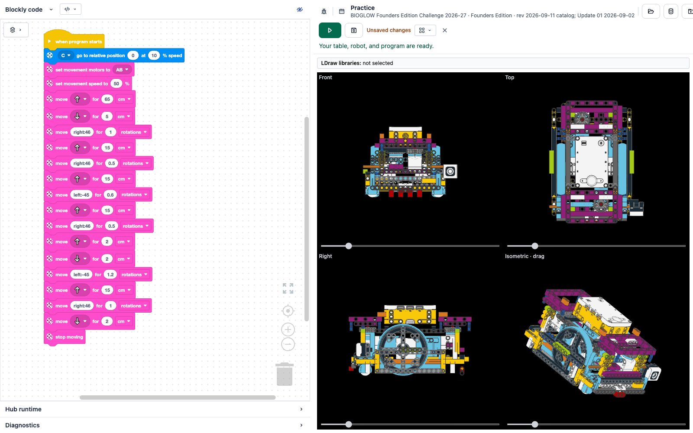

# LEGO SPIKE Simulator — BIOGLOW practice build

A browser simulator for LEGO SPIKE Prime robots: write Blockly programs, load
LDraw robots and mission models, and test a run on a simulated FLL field before
using the real robot. It runs entirely in the browser (Chromebook, macOS,
Windows) and works offline after the first load.

**Live app:** https://nathansj.github.io/lego-spike-simulator-1/

This is the `codex-commit-current-changes` branch of a fork of
[alexandrehardy/lego-spike-simulator](https://github.com/alexandrehardy/lego-spike-simulator).
It packages a self-contained BIOGLOW Founders Edition 2026–27 practice
experience (season, field, robot, missions, and a saved setup).

## What this branch contains

-   **Bundled BIOGLOW season** (`static/season/`): all 13 mission models
    (`models/45832_01..13.mpd`), the practice robot (`robots/robot-4.mpd`), the
    physics sidecars, and a manifest (`manifest.json`).
-   **Packaged practice setup** (`static/season/default.lsp-project`): the field
    (mat), robot configuration, mission placement, and a saved Blockly program.
    It **auto-loads on first run** when the scene is empty; reload it any time
    from **Expert Setup → Load → Load packaged BIOGLOW setup**.
-   **Season and mission selection**: choose the season package and add individual
    missions or all missions in a practice layout.
-   **Physics colliders**: exact triangle-mesh colliders for the fixed mission
    models, tight compound primitives for others, and a robot fitter
    (`src/lib/physics/collider-fit.ts`). Colliders are _uncalibrated_ — they are
    not verified against a physical robot or field.
-   **PWA / offline**: a web manifest and service worker
    (`static/manifest.webmanifest`, `static/sw.js`) precache the app, LDraw
    library, and season bundle so it can be installed and used offline.
-   **Programs**: write, load, and save Blockly programs (LLSP3 format).
-   **Robots**: load LDraw robots (`.ldr`/`.mpd`) or use the in-code virtual
    reference robot; port, wheel, and gearing setup is saved with the project.

## Getting started

```sh
npm install
npm run dev      # local development
npm run check    # TypeScript + Svelte checks
npm test         # Vitest suite
npm run build    # static bundle in dist/
```

## Deployment

-   **GitHub Pages**: `.github/workflows/deploy-pages.yml` builds and publishes on
    push to this branch (requires **Settings → Pages → Source: GitHub Actions**).
    The build is path-independent, so it works under the `/lego-spike-simulator-1/`
    subpath.
-   **Docker** (for a LAN/classroom server):

    ```sh
    docker build -t spike-sim .
    docker run --rm -p 8080:80 spike-sim
    ```

    Then open `http://<host>:8080` from any device.

## Assets in this branch

-   **Robot**: [`static/season/robots/robot-4.mpd`](./static/season/robots/robot-4.mpd),
    plus the virtual reference robot in
    [`src/lib/fll/virtual-reference-robot.ts`](./src/lib/fll/virtual-reference-robot.ts).
-   **Field / setup**:
    [`static/season/default.lsp-project`](./static/season/default.lsp-project)
    (mat, robot, mission placement, and program).
-   **Mission models**: [`static/season/models/`](./static/season/models).

## Screenshots



## Development team

See [the agent team and delivery roadmap](./docs/agent-team.md) for reusable
Codex specialists and [the code review](./docs/code-review-2026-09-10.md) for the
BIOGLOW readiness assessment. Repository working conventions are in
[AGENTS.md](./AGENTS.md).

## Notes and limitations

-   The simulation colliders and mechanism behaviour are **uncalibrated**; they are
    for practice and are not proof of official scoring or real-world accuracy.
-   FLL mission models and the LDraw parts library are included for the bundled
    practice experience; confirm reuse terms before redistributing publicly.
